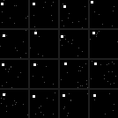
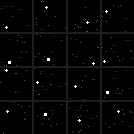
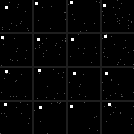

# Absolute Position Dot: A Controlled Dataset for Testing Coordinate Use in CNNs

## Motivation

Some image labels depend on **what** is visible. Other labels depend on **where** it is visible. This post studies the second case: absolute spatial position, meaning the fixed `(x, y)` location of an object in the image.

Liu et al. study this issue in [**An intriguing failing of convolutional neural networks and the CoordConv solution**](https://arxiv.org/abs/1807.03247). Their paper defines the coordinate-transform problem: mapping between Cartesian coordinates, such as `(x, y)`, and pixel-space representations, such as an image with one active pixel. The paper states in the abstract that ordinary convolutional networks fail on this apparently simple problem. Section 4 then tests this claim with supervised coordinate classification and coordinate regression.

CoordConv is the paper's proposed fix. It adds fixed coordinate channels to a convolutional layer, so the model can directly access absolute position.

## Hypothesis

This control dataset evaluates one hypothesis:

> Explicit coordinate information helps convolutional networks when the correct label depends on absolute spatial position.

## Control Dataset

The dataset is called **Absolute Position Dot**. Each sample is a 32 x 32 grayscale image with one small marker.

Main task:

- Input: an image with one square marker.
- Label: the marker's cell in a fixed 4 x 4 position grid.
- Classes: 16 balanced absolute-position classes.

Control task:

- Input: an image with one square or plus marker.
- Label: marker shape.
- Position: balanced but irrelevant to the label.

The main task tests absolute position. The control task checks that the generated images are learnable when the label does not require absolute position.

## Examples



**Figure 1. Position-task examples.** Each image contains the same square marker style. The label changes only because the marker appears in a different absolute position.



**Figure 2. Shape-control examples.** The marker position varies, but the label is only square versus plus. This checks that the image-generation process itself is not the intended difficulty.



**Figure 3. Held-out-position examples.** These samples use the same label rule as the main task, but use held-out checkerboard positions. This split tests whether a model learned the position rule rather than only memorizing sampled coordinates.

## Why The Dataset Matches The Hypothesis

The main task isolates the property from the hypothesis: absolute spatial position.

Fixed or balanced factors:

- image size: 32 x 32 pixels;
- number of objects: one marker;
- marker brightness: fixed;
- main-task marker shape: fixed square;
- noise level: fixed sparse low-intensity noise;
- class counts: balanced across all 16 position labels.

Only the marker's absolute position determines the main-task label. Therefore, a model must use where the marker is, not what the marker looks like.

The control task changes the label from position to shape. If a standard CNN handles the shape-control task but struggles more on the position task, the likely difficulty is absolute position use.

## Difference From The Paper Dataset

The CoordConv paper uses **Not-so-Clevr**, a dataset of 64 x 64 images with 9 x 9 squares. Its tasks include coordinate-to-pixel classification, pixel-to-coordinate regression, and square rendering.

Absolute Position Dot does not recreate Not-so-Clevr. It tests the same paper-motivated property with a different controlled dataset: small marker images, position-bin labels, a held-out-position split, and a shape-control split.

## Generation

The dataset is generated by `src/generate_absolute_position_dot.py`.

For each sample, the generator:

1. Chooses a marker center `(x, y)` inside the image margin.
2. Assigns the 4 x 4 position-bin label.
3. Draws a square or plus marker.
4. Adds sparse low-intensity pixel noise.
5. Saves the image, exact coordinate, normalized coordinate, position label, and shape label.

The generator uses fixed seed `20260616`. The dataset can be regenerated with:

```bash
python main.py
```

The dataset can be checked with:

```bash
python validate.py
```

The generated files are:

- `data/*.npz`: compressed NumPy arrays for ML use;
- `data/annotations.csv`: one human-readable row per sample;
- `data/split_summary.csv`: split sizes and class balance;
- `data/metadata.json`: hypothesis and generation settings;
- `data/examples/*.png`: preview images.

## Links

- Paper: https://arxiv.org/abs/1807.03247
- GitHub repository: https://github.com/Vlad13503/absolute-position-dot-control-dataset
- Generator code: https://github.com/Vlad13503/absolute-position-dot-control-dataset/blob/main/src/generate_absolute_position_dot.py
- Validation code: https://github.com/Vlad13503/absolute-position-dot-control-dataset/blob/main/src/validate_dataset.py
- Dataset files: https://github.com/Vlad13503/absolute-position-dot-control-dataset/tree/main/data
